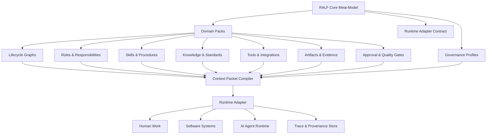

<div align="center">

# RALF

### Structure your organization before you automate it.

**RALF** is an open framework for modeling organizational lifecycles, roles, knowledge, workflows, artifacts, governance gates, and AI-ready task context.

It helps teams turn real-world domain expertise into structured operating models that humans, software systems, and AI agents can safely work with.

[](#project-status)
[](#what-is-ralf)
[](#why-ralf)
[](#license)

</div>

---

## What is RALF?

**RALF** stands for **Role-Agent Lifecycle Framework**.

RALF is not another chatbot, workflow engine, or agent runtime. It is a **standards-composing framework** for describing how work should happen inside an organization before automation is introduced.

A RALF model connects:

- **Lifecycles** — the phases of work from start to finish.
- **Domains** — the business, technical, operational, or scientific areas involved.
- **Roles** — who is responsible, accountable, consulted, or informed.
- **Agents** — human or AI executors operating within bounded responsibilities.
- **Skills** — reusable procedures for performing tasks.
- **Knowledge** — policies, standards, domain facts, examples, and lessons learned.
- **Tools** — systems, APIs, data sources, and integrations.
- **Artifacts** — evidence, documents, outputs, records, and decisions.
- **Gates** — approvals, validations, controls, and quality checks.
- **Traces** — audit history of what happened, why, and by whom.

The goal is simple:

> Make organizational knowledge structured enough to be reused, governed, automated, and safely supported by AI.

---

## Why RALF?

Many organizations want to use AI, but their internal context is scattered across documents, tools, meetings, experts, and undocumented habits.

This creates a common failure pattern:

```text
Unclear lifecycle → unclear ownership → weak context → unreliable automation → low trust
```

RALF starts from the opposite direction:

```text
Lifecycle → roles → knowledge → artifacts → gates → context packets → safe execution
```

RALF helps organizations answer questions like:

- What lifecycle are we trying to improve?
- Which roles are responsible for each phase?
- What knowledge and standards should guide the work?
- What artifacts must be produced or reviewed?
- Which tasks can be assisted by AI?
- Which decisions must remain under human control?
- What evidence do we need for trust, audit, and improvement?

---

## What RALF is not

RALF is not intended to replace existing systems or standards.

It is not:

- a replacement for BPMN, DMN, RACI, ISO standards, or governance frameworks
- a replacement for agent runtimes or orchestration tools
- a replacement for ERP, MES, PLM, CMMS, CRM, Git, ticketing, or documentation systems
- a generic prompt library
- a chatbot-first automation product

RALF is a **binding layer** that helps organizations compose existing standards, systems, roles, workflows, and AI capabilities into a coherent operating model.

---

## Core idea

A business lifecycle defines **what must happen**.  
Roles define **who is responsible**.  
Skills define **how work is performed**.  
Knowledge defines **what must be known**.  
Tools enable **action**.  
Artifacts preserve **evidence**.  
Gates enforce **control**.  
Traces prove **what happened**.

RALF binds these pieces into reusable **domain packs** and executable **context packets**.

---

## Architecture at a glance



---

## Repository map

```text
.
├── README.md
├── CITATION.cff
├── CONTRIBUTING.md
├── SECURITY.md
├── roadmap.md
├── docs/
│   ├── foundations.md
│   ├── core-concepts.md
│   ├── architecture.md
│   ├── domain-packs.md
│   ├── context-packets.md
│   └── governance.md
└── examples/
    └── software-development-basic/
        └── ralf-project.yaml
```

---

## Documentation

Start here:

- [Foundations](docs/foundations.md) — the standards and references RALF builds on.
- [Core concepts](docs/core-concepts.md) — lifecycle, role, domain, skill, artifact, gate, trace, and context packet.
- [Architecture](docs/architecture.md) — the high-level system structure.
- [Domain packs](docs/domain-packs.md) — reusable models for specific fields or organizations.
- [Context packets](docs/context-packets.md) — how task-specific context is packaged for safe execution.
- [Governance](docs/governance.md) — human control, risk, gates, and evidence.

---

## Minimal example

```yaml
ralf_version: "0.1"
project:
  id: software-development-basic
  name: Software Development Basic
  purpose: Model a simple software delivery lifecycle with roles, artifacts, gates, and AI-ready context.

lifecycle:
  id: software-delivery
  phases:
    - id: discovery
      name: Discovery
      outputs: [problem-brief]
    - id: design
      name: Design
      inputs: [problem-brief]
      outputs: [solution-design]
    - id: build
      name: Build
      inputs: [solution-design]
      outputs: [implementation]
    - id: review
      name: Review
      inputs: [implementation]
      outputs: [review-record]
    - id: release
      name: Release
      inputs: [review-record]
      outputs: [release-notes]

roles:
  - id: product-owner
    responsibilities: [define outcome, approve scope]
  - id: solution-architect
    responsibilities: [design solution, identify risks]
  - id: developer
    responsibilities: [implement changes, provide evidence]
  - id: reviewer
    responsibilities: [review quality, approve release]

gates:
  - id: design-approval
    phase: design
    approver_role: product-owner
    pass_criteria:
      - problem is clearly stated
      - success criteria are defined
      - risks are documented
```

See the full example in [`examples/software-development-basic/ralf-project.yaml`](examples/software-development-basic/ralf-project.yaml).

---

## Project status

RALF is in **early framework design**.

Current focus:

- defining the core meta-model
- documenting the framework foundations
- creating the first examples
- designing schema structure
- separating framework concepts from product implementation

Not stable yet:

- schema names and fields
- adapter contracts
- domain pack format
- context packet format
- governance profile format

---

## Contributing

RALF should reuse existing standards where possible and only define new concepts where the binding layer requires them.

Before proposing a new concept, check whether an existing standard, framework, protocol, or well-known pattern already solves the problem.

See [CONTRIBUTING.md](CONTRIBUTING.md).

---

## Citation

If you use RALF in research, documentation, or public work, please cite it using the metadata in [`CITATION.cff`](CITATION.cff).

---

## License

License is **TBD** for this draft repository.

Recommended direction: Apache License 2.0 for code and a Creative Commons license for documentation/specification content, subject to final legal review.
