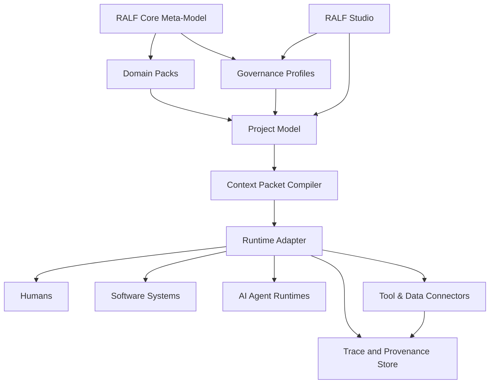
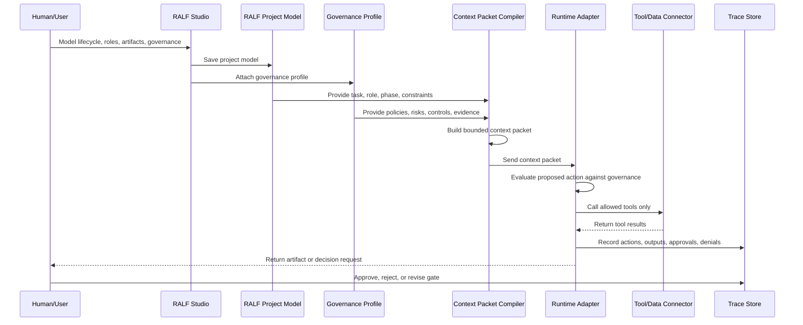

# RALF Architecture

RALF is designed as a framework layer, not as a single runtime.

It should be able to support humans, existing software systems, AI agents, and future runtimes without locking the framework to one vendor or product.

RALF separates the model of work from the execution of work. This allows organizations to define lifecycles, roles, artifacts, governance controls, and context before deciding which runtime or product should execute a task.

---

## Architecture goals

1. **Separate model from execution.** A RALF model should exist independently from any runtime.
2. **Keep context bounded.** Runtime actors should receive only the context they need for a task.
3. **Treat governance as a dynamic layer.** Policies, risks, controls, approval rules, and evidence requirements should be versioned and applied to work.
4. **Preserve human accountability.** High-risk actions require explicit gates and evidence.
5. **Support traceability.** Every run should be explainable through traces and artifacts.
6. **Reuse standards.** RALF should compose existing standards instead of replacing them.
7. **Enable domain packs.** Domain knowledge should be packageable, versioned, and reusable.
8. **Support validation through Studio.** RALF Studio should test whether the framework can be applied by real users to real workflows.

---

## High-level layers



---

## 1. Core meta-model

The core meta-model defines the common object types and relationships used by all RALF projects.

Core object types:

- domain
- lifecycle
- phase
- role
- agent
- skill
- knowledge asset
- tool
- artifact
- governance profile
- policy
- control
- evidence requirement
- gate
- trace
- context packet

The meta-model should be stable, small, and carefully versioned.

---

## 2. Domain packs

A domain pack packages reusable structure for a domain.

A domain pack can include:

- lifecycle templates
- role templates
- skill templates
- artifact templates
- gate templates
- knowledge references
- tool profiles
- governance profiles
- example context packets

Domain packs should be installable, inspectable, customizable, and versioned.

---

## 3. Governance profiles

A governance profile defines policies, risks, controls, evidence requirements, approval rules, and runtime expectations for a project, lifecycle, task, domain pack, or adapter.

Governance profiles are not compliance certificates. They are structured representations of governance intent and control requirements.

A governance profile can include:

- scope
- owner role
- referenced policies or standards
- risk model
- required controls
- approval rules
- evidence requirements
- prohibited or restricted actions
- trace requirements
- review cycle

Example:

```yaml
governance_profile:
  id: software-delivery-basic-governance
  version: "0.1.0"
  owner_role: governance-owner
  required_controls:
    - human-review-for-release
    - preserve-review-evidence
    - trace-tool-actions
```

---

## 4. Project model

A project model is a concrete application of RALF for a specific organization, team, product, workflow, or domain.

It may import one or more domain packs and customize them.

```yaml
project:
  id: acme-maintenance
  imports:
    - ralf-domain-pack/predictive-maintenance-basic@0.1
  governance:
    profiles:
      - acme-maintenance-governance@0.1
  overrides:
    roles:
      maintenance-planner:
        name: Maintenance Coordinator
```

---

## 5. Context packet compiler

The context packet compiler converts model structure into task-specific packets.

It selects:

- task objective
- lifecycle phase
- role binding
- allowed tools
- required knowledge
- input artifacts
- expected output artifacts
- governance profile
- policy references
- risk constraints
- evidence requirements
- approval gates
- trace requirements

The compiler should prevent context flooding. It should not hand the entire organization model to every actor.

---

## 6. Runtime adapters

A runtime adapter translates a context packet into instructions, tool permissions, and execution constraints for a specific target.

Targets may include:

- human work instructions
- workflow tools
- ticketing systems
- AI agent runtimes
- automation platforms
- integration services

RALF should avoid hard-coding one runtime.

---

## 7. Runtime governance

Runtime governance is the enforcement or evaluation boundary between a proposed action and its execution.

```text
Context packet → proposed action → governance evaluation → allow / deny / require approval → trace
```

A runtime adapter should be able to evaluate:

- actor identity
- role binding
- lifecycle phase
- governance profile
- proposed action
- target tool or artifact
- risk level
- approval requirement
- evidence requirement

Early RALF versions may implement this as a manual or advisory pattern. Later implementations may use middleware, filters, policy-as-code, or adapter-level enforcement.

---

## 8. Tool and data connectors

Tool connectors expose systems safely.

A connector definition should include:

- tool name
- protocol
- operations
- permissions
- input schema
- output schema
- failure modes
- security constraints
- audit requirements
- governance constraints

---

## 9. Trace and provenance store

RALF should store evidence of execution.

A trace should capture:

- who or what acted
- what task was attempted
- which role was active
- which governance profile applied
- which context packet was used
- which inputs were used
- which tools were called
- which outputs were produced
- which gates passed or failed
- which human approvals occurred
- which actions were denied or escalated

This supports audit, debugging, quality improvement, and trust.

---

## 10. RALF Studio

RALF Studio is the planned visual modeling environment for validating and applying the framework.

Studio should help users:

- define lifecycles
- assign roles
- define artifacts
- attach governance profiles
- model gates and evidence requirements
- compile context packets
- inspect model completeness
- test whether the framework is understandable by real users

Studio is part of the validation path for RALF. It should not be presented as proof that the framework is already validated.

---

## Data flow



---

## Stability policy

During the early design stage, the following are unstable:

- schema field names
- adapter contracts
- context packet format
- domain pack manifest format
- governance profile format
- runtime enforcement model
- Studio UX and validation method

Stable principle:

> The lifecycle-role-artifact-governance-gate-trace chain is the backbone of RALF.
