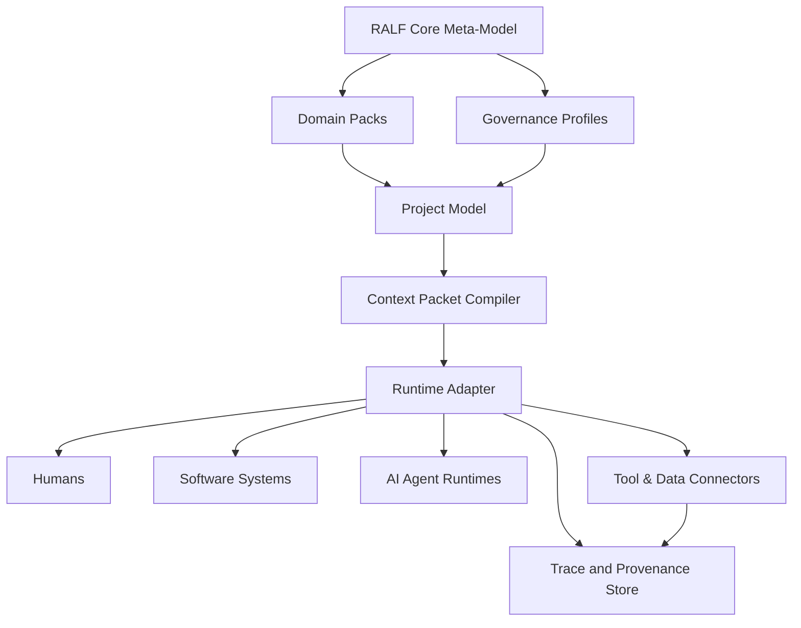
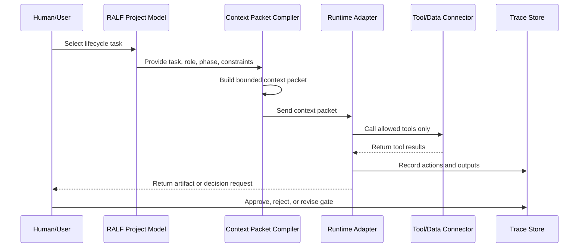

# RALF Architecture

RALF is designed as a framework layer, not as a single runtime.

It should be able to support humans, existing software systems, AI agents, and future runtimes without locking the framework to one vendor or product.

## Architecture goals

1. **Separate model from execution.** A RALF model should exist independently from any runtime.
2. **Keep context bounded.** Runtime actors should receive only the context they need for a task.
3. **Preserve human accountability.** High-risk actions require explicit gates and evidence.
4. **Support traceability.** Every run should be explainable through traces and artifacts.
5. **Reuse standards.** RALF should compose existing standards instead of replacing them.
6. **Enable domain packs.** Domain knowledge should be packageable, versioned, and reusable.

## High-level layers



## 1. Core meta-model

The core meta-model defines the common object types and relationships used by all RALF projects.

Core object types:

- domain
- lifecycle
- phase
- role
- agent
- skill
- knowledge asset
- tool
- artifact
- gate
- trace
- context packet

The meta-model should be stable, small, and carefully versioned.

## 2. Domain packs

A domain pack packages reusable structure for a domain.

A domain pack can include:

- lifecycle templates
- role templates
- skill templates
- artifact templates
- gate templates
- knowledge references
- tool profiles
- governance profiles
- example context packets

Domain packs should be installable, inspectable, customizable, and versioned.

## 3. Project model

A project model is a concrete application of RALF for a specific organization, team, product, workflow, or domain.

It may import one or more domain packs and customize them.

```yaml
project:
  id: acme-maintenance
  imports:
    - ralf-domain-pack/predictive-maintenance-basic@0.1
  overrides:
    roles:
      maintenance-planner:
        name: Maintenance Coordinator
```

## 4. Context packet compiler

The context packet compiler converts model structure into task-specific packets.

It selects:

- task objective
- lifecycle phase
- role binding
- allowed tools
- required knowledge
- input artifacts
- expected output artifacts
- gates
- risk constraints
- trace requirements

The compiler should prevent context flooding. It should not hand the entire organization model to every actor.

## 5. Runtime adapters

A runtime adapter translates a context packet into instructions, tool permissions, and execution constraints for a specific target.

Targets may include:

- human work instructions
- workflow tools
- ticketing systems
- AI agent runtimes
- automation platforms
- integration services

RALF should avoid hard-coding one runtime.

## 6. Tool and data connectors

Tool connectors expose systems safely.

A connector definition should include:

- tool name
- protocol
- operations
- permissions
- input schema
- output schema
- failure modes
- security constraints
- audit requirements

## 7. Trace and provenance store

RALF should store evidence of execution.

A trace should capture:

- who or what acted
- what task was attempted
- which context packet was used
- which inputs were used
- which tools were called
- which outputs were produced
- which gates passed or failed
- which human approvals occurred

This supports audit, debugging, quality improvement, and trust.

## Data flow



## Stability policy

During the early design stage, the following are unstable:

- schema field names
- adapter contracts
- context packet format
- domain pack manifest format
- governance profile format

Stable principle:

> The lifecycle-role-artifact-gate-trace chain is the backbone of RALF.
