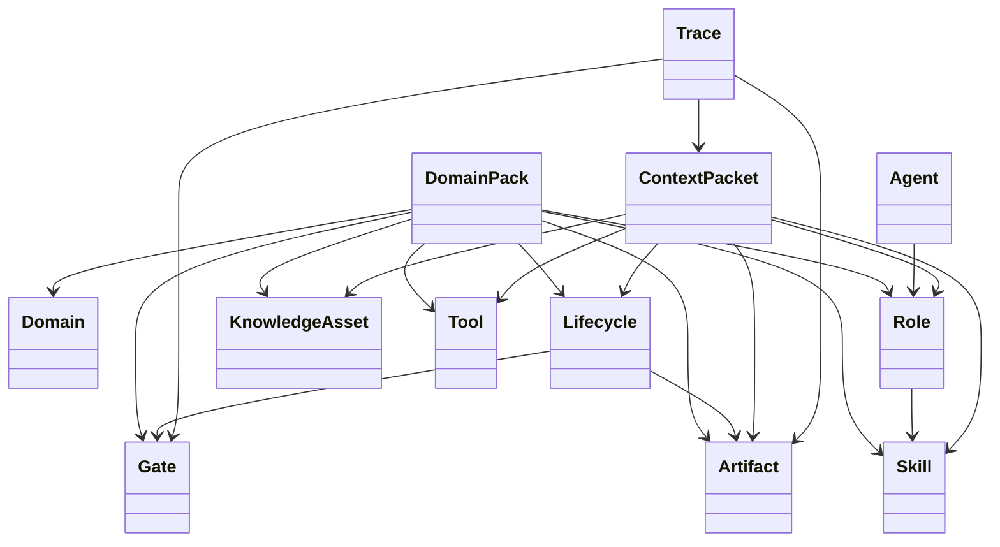

# RALF Core Concepts

This document defines the core vocabulary of RALF.

RALF should use simple language at the user-facing level while preserving a rigorous model underneath.

## 1. Domain

A **domain** is an area of knowledge, work, responsibility, or operations.

Examples:

- software development
- predictive maintenance
- production planning
- quality management
- healthcare operations
- logistics
- compliance

A domain may contain subdomains.

```yaml
domain:
  id: software-development
  name: Software Development
  subdomains:
    - requirements
    - architecture
    - implementation
    - testing
    - release
```

## 2. Lifecycle

A **lifecycle** describes how work moves from beginning to end.

A lifecycle should include:

- phases
- transitions
- inputs
- outputs
- responsible roles
- gates
- artifacts
- risks
- improvement loops

```yaml
lifecycle:
  id: software-delivery
  phases:
    - discovery
    - design
    - build
    - review
    - release
```

RALF principle:

> Start with the lifecycle before designing agents, prompts, or automation.

## 3. Role

A **role** describes responsibility, authority, accountability, and participation.

A role is not necessarily a job title. One person may play multiple roles, and one role may be performed by multiple people.

```yaml
role:
  id: reviewer
  responsibilities:
    - inspect artifact quality
    - verify evidence
    - approve or reject release
  permissions:
    - read implementation artifacts
    - approve review gate
```

## 4. Agent

An **agent** is an executor that performs bounded work.

An agent can be:

- a human
- a software service
- an AI agent
- a hybrid human-AI workflow

RALF principle:

> Agents execute tasks, but humans and organizations remain accountable for outcomes.

## 5. Skill

A **skill** is a reusable procedure for doing work.

A skill should describe:

- purpose
- inputs
- procedure
- required knowledge
- required tools
- expected outputs
- quality checks
- failure conditions

```yaml
skill:
  id: write-release-notes
  purpose: Produce release notes from approved changes.
  inputs:
    - change-log
    - review-record
  outputs:
    - release-notes
```

## 6. Knowledge asset

A **knowledge asset** is any piece of knowledge needed to perform or judge work.

Examples:

- policy
- standard
- manual
- SOP
- architecture decision record
- code guideline
- regulation reference
- customer requirement
- lesson learned

```yaml
knowledge_asset:
  id: secure-coding-guideline
  type: guideline
  owner_role: security-lead
  version: "1.0"
```

## 7. Tool

A **tool** is a system, API, file, database, device, or service used to perform work.

RALF tool definitions should include permissions and constraints.

```yaml
tool:
  id: issue-tracker
  type: system
  permissions:
    - read_issues
    - create_comment
  guardrails:
    - no_status_change_without_human_approval
```

## 8. Artifact

An **artifact** is an output, input, evidence item, or record.

Examples:

- problem brief
- solution design
- work order
- source code diff
- test report
- review record
- release note
- audit log

```yaml
artifact:
  id: solution-design
  type: document
  required_fields:
    - problem
    - proposed_solution
    - risks
    - acceptance_criteria
```

## 9. Gate

A **gate** is a control point.

A gate can be:

- a human approval
- an automated check
- a decision rule
- a quality threshold
- a risk review
- a compliance validation

```yaml
gate:
  id: release-approval
  approver_role: reviewer
  pass_criteria:
    - tests_passed
    - review_record_exists
    - release_notes_created
```

## 10. Trace

A **trace** records what happened.

A trace should connect:

- task
- actor or agent
- input artifacts
- output artifacts
- tool calls
- decisions
- gate outcomes
- timestamps
- provenance

Traceability is required for trust, audit, debugging, learning, and improvement.

## 11. Context packet

A **context packet** is a bounded bundle of task-specific information.

It is compiled from the RALF model for a specific task.

A context packet should answer:

- What is the task?
- Which lifecycle phase is it part of?
- Which role is acting?
- What is the authority boundary?
- What knowledge is needed?
- What tools are allowed?
- What output is expected?
- What gate or review is required?
- What evidence must be produced?

```yaml
context_packet:
  id: cp-release-notes-001
  task: draft-release-notes
  lifecycle_phase: release
  role: developer
  allowed_tools:
    - issue-tracker.read
    - git.read
  required_outputs:
    - release-notes
  requires_human_approval: true
```

## Concept relationship


